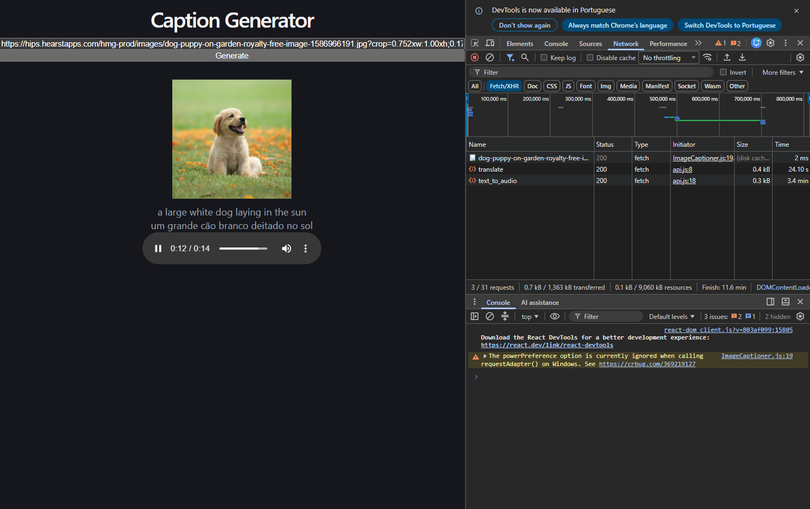
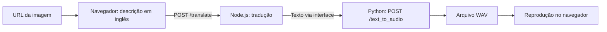

# Modelos públicos de IA: da imagem à narração

Projeto de aprendizado que combina três modelos pré-treinados para transformar a URL de uma imagem em uma descrição em inglês, traduzir essa descrição para português e gerar sua narração em áudio.

O projeto explora modelos públicos da [Hugging Face](https://huggingface.co/spaces) em JavaScript e Python. O código realiza inferência com modelos existentes, sem treinamento ou ajuste dos pesos.



## Como funciona

1. O usuário informa uma URL de imagem e clica em **Generate**.
2. O navegador executa o modelo de descrição e mostra a legenda em inglês.
3. A interface envia a legenda ao servidor Node.js e recebe a tradução para português.
4. A tradução é enviada ao servidor Python, que gera um arquivo WAV.
5. A interface carrega o áudio e tenta reproduzi-lo, oferecendo também controles manuais.



Os servidores não se comunicam diretamente: a interface coordena as chamadas em sequência.

## Componentes e documentação

| Pasta | Responsabilidade | Tecnologias | Endereço local |
| --- | --- | --- | --- |
| [image-to-text-app](image-to-text-app/README.md) | Interface, descrição de imagens e integração das etapas | React, Vite e Transformers.js | `http://localhost:5173` |
| [server_node](server_node/README.md) | API de tradução de inglês para português | Node.js, Express e Transformers.js | `http://localhost:3000` |
| [server_python](server_python/README.md) | Síntese de voz e entrega dos arquivos WAV | Python, Flask, Transformers e SciPy | `http://localhost:5000` |

Cada README contém instalação, execução, organização dos arquivos e limitações. Os READMEs dos servidores também documentam endpoints e Docker.

## Modelos utilizados

| Etapa | Identificador no código | Configuração |
| --- | --- | --- |
| Imagem para texto | `Xenova/vit-gpt2-image-captioning` | `dtype: "q8"` e `do_sample: true` |
| Tradução | `Xenova/nllb-200-distilled-600M` | `dtype: "q8"`, de `eng_Latn` para `por_Latn` |
| Texto para áudio | `suno/bark-small` | Voz `v2/pt_speaker_8` |

As pipelines JavaScript reutilizam o modelo carregado. O Python instancia o modelo a cada solicitação. A primeira utilização exige o download dos arquivos; a inferência acontece no navegador ou nos servidores locais, conforme a etapa. O código não configura tokens nem uma API remota de inferência.

## Executando o projeto completo

Tenha Node.js e npm compatíveis com as dependências (o Dockerfile Node usa `24.20.0`), Python **3.14 ou superior** e **uv** instalados. Reserve espaço para os modelos e acesso à internet para instalar dependências e baixar seus arquivos.

Abra três terminais na raiz do repositório e mantenha os processos ativos.

**Terminal 1 — tradução:**

```bash
cd server_node
npm ci
node index.js
```

**Terminal 2 — áudio:**

```bash
cd server_python
uv sync --locked
uv run python -c "from pathlib import Path; Path('audio').mkdir(exist_ok=True)"
uv run server-python --host=0.0.0.0 --port=5000
```

**Terminal 3 — interface:**

```bash
cd image-to-text-app
npm ci
npm run dev -- --port 5173 --strictPort
```

Acesse `http://localhost:5173`, informe uma URL direta de imagem e clique em **Generate**. Aguarde as três etapas; o tempo depende da conexão e dos recursos da máquina.

Os servidores possuem arquivos Compose próprios. Não existe um Compose na raiz que inicie toda a aplicação. Consulte as instruções de [Docker do Node.js](server_node/README.md#docker) e de [Docker do Python](server_python/README.md#docker).

## Limitações atuais

- Os endereços das APIs estão fixos no frontend. O CORS do Node.js permite a origem `http://localhost:5173`; outra porta ou hostname exige ajustes.
- A imagem precisa estar acessível por URL e permitir seu processamento pelo navegador. Restrições de CORS podem impedir a geração da descrição.
- A interface não trata falhas das APIs, URLs inválidas ou cliques simultâneos durante a geração.
- Descrições, traduções e falas podem conter erros. Uma imprecisão pode se propagar às etapas seguintes.
- Os WAVs ficam em `server_python/audio/`, sem limpeza automática. O modelo de voz é carregado novamente a cada requisição.
- Não há uma suíte de testes automatizados configurada para o fluxo completo.

## Aprendizados explorados

O projeto permite estudar escolha de modelos por tarefa, pipelines de inferência, quantização nas etapas JavaScript e integração entre ambientes diferentes. Também exercita chamadas HTTP, atualização assíncrona da interface e geração e reprodução de áudio.
